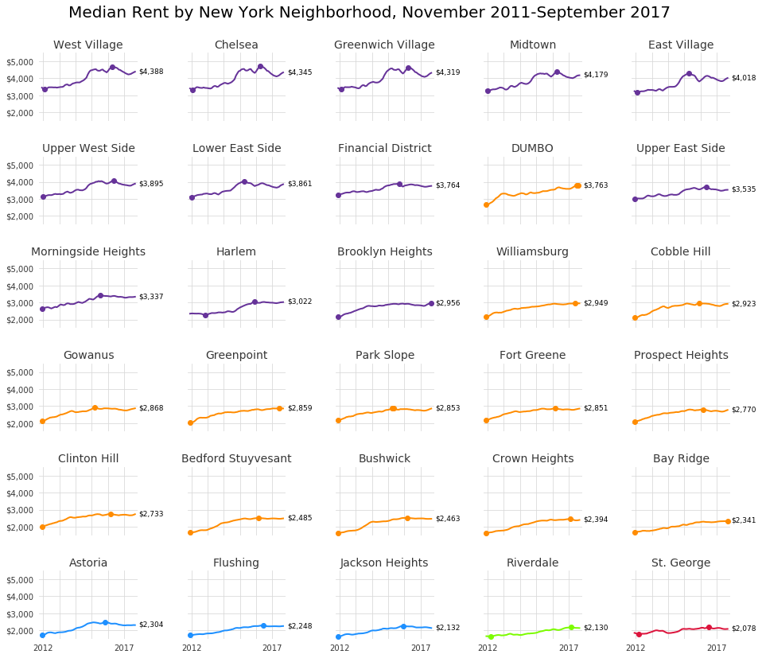

Worked solo on assignment as required.
  

  
<b>Figure 1</b>: Median rent for November 2011 - September 2017 for 30 select New York City neighborhoods across the five boroughs. Dots on lines represent the maximum and minimum rent for the period covered. Labels beside points show the latest median rent.
 
<b>Source</b>: Zillow (https://www.zillow.com/research/data/#rental-data).
